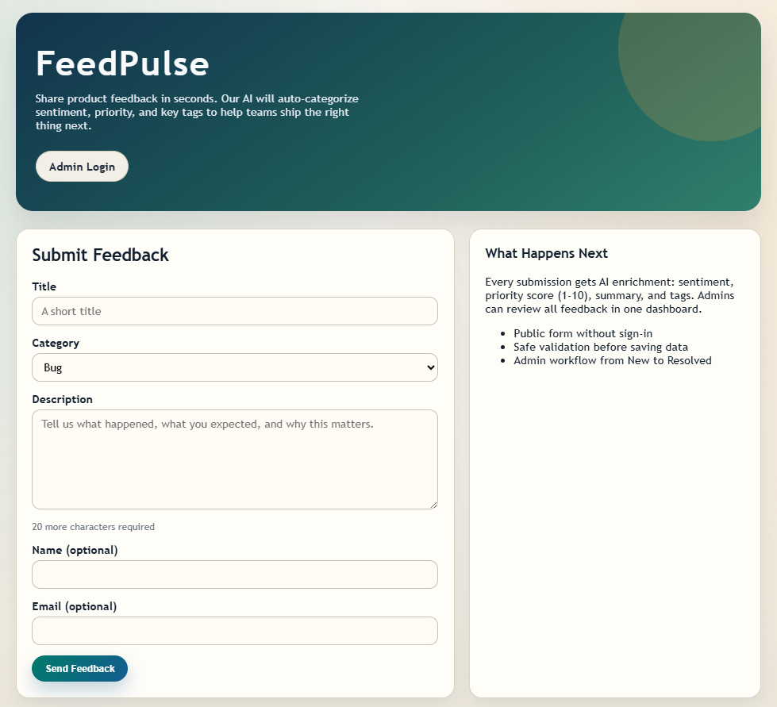
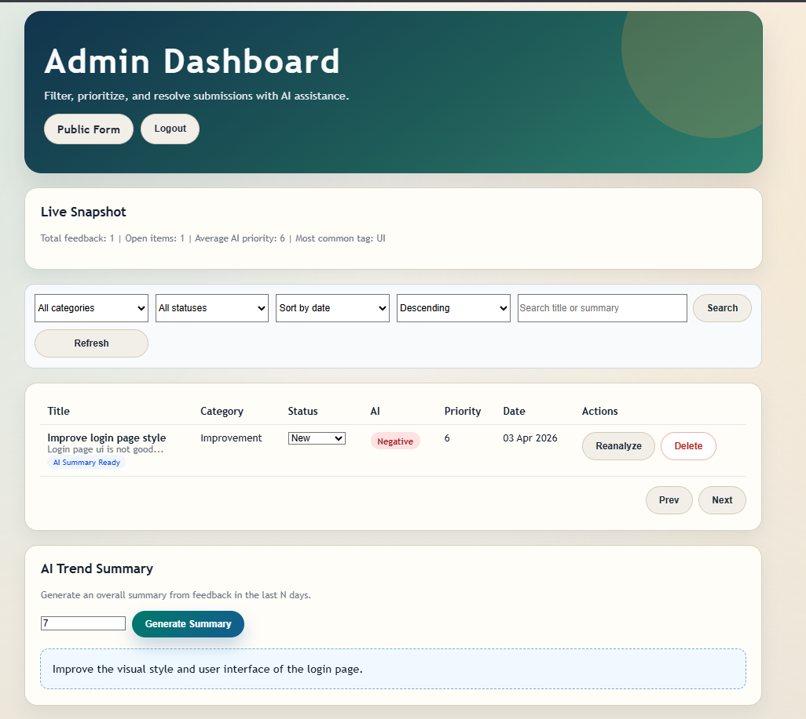

# FeedPulse - AI-Powered Product Feedback Platform

FeedPulse is a full-stack app for collecting product feedback and helping teams triage it faster with AI enrichment.

Users can submit feedback publicly (no sign-in), while admins can log in to review, filter, reanalyze, and resolve feedback from a dashboard.

## Screenshots

<h3 align="center">Public Feedback Form</h3>
<p align="center">
  
</p>

<h3 align="center">Admin Dashboard</h3>
<p align="center">
  
</p>

## Tech Stack

- Frontend: Next.js 14, React 18, TypeScript
- Backend: Node.js, Express, TypeScript
- Database: MongoDB, Mongoose
- AI: Google Gemini via `@google/generative-ai`

## Core Features

- Public feedback form with validation
- Optional submitter name and email fields
- AI enrichment per submission:
  - Category normalization
  - Sentiment (Positive, Neutral, Negative)
  - Priority score (1-10)
  - AI summary
  - AI tags
- Admin login with JWT
- Protected admin dashboard with:
  - Filters by category and status
  - Search by title, summary, and description
  - Sorting by date, AI priority, or AI sentiment
  - Pagination
  - Status workflow: New -> In Review -> Resolved
  - Reanalyze action to rerun AI for a feedback item
  - Delete action
  - Snapshot stats (total, open items, avg priority, most common tag)
- AI trend summary endpoint for last N days
- In-memory submission rate limit: 5 submissions/hour per IP
- CORS allowlist support via environment variable

## Project Structure

```text
FeedPluse/
|-- frontend/
|   |-- app/
|   |   |-- page.tsx
|   |   |-- login/page.tsx
|   |   |-- dashboard/page.tsx
|   |-- lib/api.ts
|
|-- backend/
|   |-- src/
|   |   |-- config/
|   |   |-- controllers/
|   |   |-- middleware/
|   |   |-- models/
|   |   |-- routes/
|   |   |-- services/
|   |   |-- app.ts
|   |   |-- server.ts
|   |-- tests/
|
|-- docker-compose.yml
|-- README.md
```

## API Overview

Base URL (local): `http://localhost:4000`

Public routes:

- `GET /health`
- `POST /api/auth/login`
- `POST /api/feedback`

Admin routes (Bearer token required):

- `GET /api/feedback`
- `GET /api/feedback/summary?days=7`
- `GET /api/feedback/:id`
- `PATCH /api/feedback/:id`
- `DELETE /api/feedback/:id`
- `POST /api/feedback/:id/reanalyze`

### `GET /api/feedback` query params

- `page` (default: 1)
- `pageSize` (default: 10, max: 50)
- `category` (`Bug | Feature Request | Improvement | Other`)
- `status` (`New | In Review | Resolved`)
- `q` (text search)
- `sortBy` (`createdAt | ai_priority | ai_sentiment`, default: `createdAt`)
- `sortOrder` (`asc | desc`, default: `desc`)

### Response Shape

All endpoints return a consistent JSON envelope:

```json
{
  "success": true,
  "data": {},
  "error": null,
  "message": "..."
}
```

## Environment Variables

Backend (`backend/.env`):

```env
PORT=4000
MONGODB_URI=mongodb://localhost:27017/feedpulse
JWT_SECRET=feedpulse-super-secret-jwt-key-2026
GEMINI_API_KEY=your-gemini-api-key
ADMIN_EMAIL=admin@feedpulse.dev
ADMIN_PASSWORD=Admin@123
CLIENT_ORIGIN=http://localhost:3000
```

Notes:

- `CLIENT_ORIGIN` can be a comma-separated allowlist (for example: `http://localhost:3000,http://localhost:3001`).
- Localhost origins are also accepted by regex in the backend CORS config.

Frontend (`frontend/.env.local`):

```env
NEXT_PUBLIC_API_BASE_URL=http://localhost:4000
```

Root (`.env`, used by Docker Compose):

```env
GEMINI_API_KEY=your-gemini-api-key
JWT_SECRET=feedpulse-super-secret-jwt-key-2026
ADMIN_EMAIL=admin@feedpulse.dev
ADMIN_PASSWORD=Admin@123
```

## Run With Docker (Recommended)

1. Create Docker env file

```bash
cp .env.example .env
```

On Windows PowerShell:

```powershell
Copy-Item .env.example .env
```

2. Set your Gemini key in `.env`

```env
GEMINI_API_KEY=your-real-gemini-api-key
```

3. Build and start all services

```bash
docker compose up --build
```

This starts:

- Frontend on `http://localhost:3000`
- Backend on `http://localhost:4000`
- MongoDB on `mongodb://localhost:27017`

4. Stop services

```bash
docker compose down
```

### Docker Commands You Will Use Most

Run in detached mode:

```bash
docker compose up -d --build
```

View logs for all services:

```bash
docker compose logs -f
```

View logs for one service:

```bash
docker compose logs -f backend
docker compose logs -f frontend
docker compose logs -f mongo
```

Rebuild only one service:

```bash
docker compose up -d --build backend
```

Stop and remove containers + networks:

```bash
docker compose down
```

Stop and also remove Mongo data volume (reset DB):

```bash
docker compose down -v
```

Health checks:

- Backend: `http://localhost:4000/health`
- Frontend: `http://localhost:3000`

## Run Locally

1. Start MongoDB

```bash
docker compose up -d mongo
```

2. Start backend

```bash
cd backend
npm install
npm run dev
```

3. Start frontend

```bash
cd frontend
npm install
npm run dev
```

4. Open the app

- Public form: `http://localhost:3000`
- Admin login: `http://localhost:3000/login`
- Dashboard: `http://localhost:3000/dashboard`

## Admin Credentials (Local)

- Email: `admin@feedpulse.dev`
- Password: `Admin@123`

Use the values from your backend `.env` file.

## Scripts

Backend (`backend/package.json`):

- `npm run dev` - start API in watch mode
- `npm run build` - compile TypeScript
- `npm start` - run compiled server
- `npm run lint` - type-check (`tsc --noEmit`)
- `npm test` - run tests once
- `npm run test:watch` - run tests in watch mode

Frontend (`frontend/package.json`):

- `npm run dev` - start Next.js dev server
- `npm run build` - production build
- `npm start` - run production app
- `npm run lint` - Next.js lint

## Testing

Backend tests cover:

- Feedback route validation and auth protection
- AI enrichment trigger behavior
- Gemini response normalization behavior

Run:

```bash
cd backend
npm test
```

## AI Processing Notes

- AI enrichment for new feedback runs in the background after submission.
- Submission succeeds even if AI processing fails.
- Gemini model fallback order is implemented in service logic.

## Security and Ops Notes

- Never commit `.env` files.
- Use a strong `JWT_SECRET` in non-local environments.
- Rotate your Gemini API key if it is exposed.
- Current rate limit storage is in-memory; use Redis or another shared store for multi-instance deployments.


